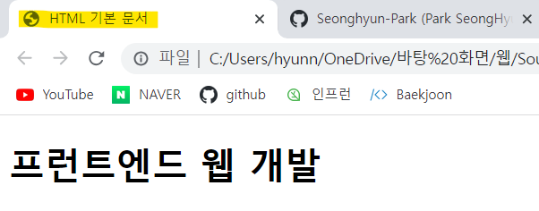
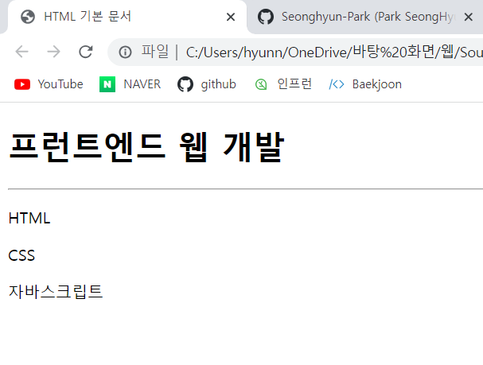
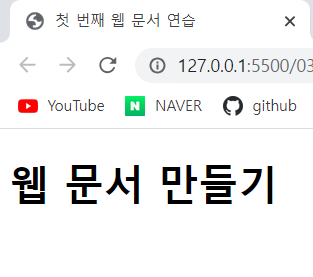
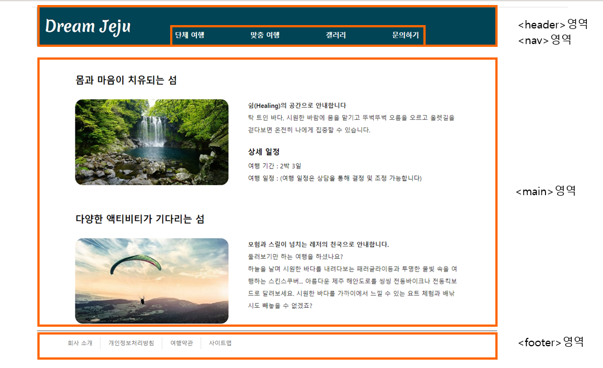
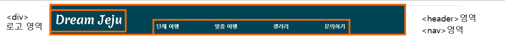
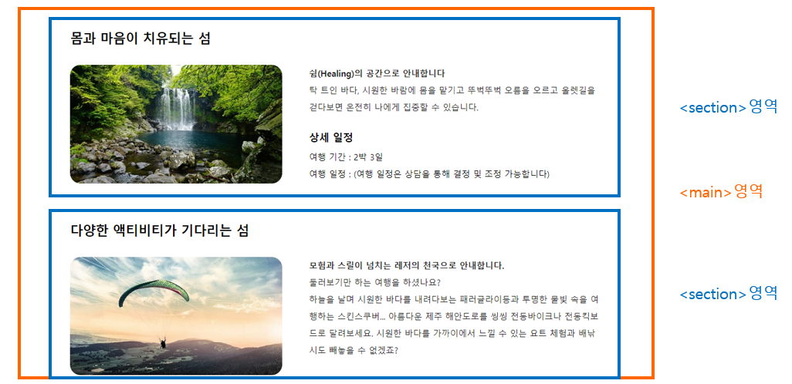

## 03-1 HTML과 첫 만남

### HTML(HyperText Markup Language)
- HyperText: 문서를 서로 연결해 주는 링크
- 웹 문서를 만드는 언어
- 태그(tag): 웹 브라우저가 어느 부분이 제목, 텍스트 또는 표인지 구별할 수 있도록 붙힌 꼬리표

## 03-2 HTML 구조 파악하기

```html
<!DOCTYPE html> <!--현재 문서가 HTML5 언어로 작성한 웹 문서라는 뜻-->
<html lang="ko"> <!--웹 문서의 시작과 끝을 나타내는 태그-->
<head> <!--웹 브라우저가 웹 문서를 해석하는데 필요한 정보를 입력하는 부분-->
  <meta charset="UTF-8">
  <title>HTML 기본 문서</title>
</head>
<body> <!--실제로 웹 브라우저 화면에 나타나는 내용-->
  <h1>프런트엔드 웹 개발</h1>
  <hr>
  <p>HTML</p>
  <p>CSS</p>
  <p>자바스크립트</p>
</body>
</html> <!--까지 소스를 읽어 화면에 표시-->
```

### 웹 문서의 유형을 지정하는 선언문 - < !DOCTYPE html > 태그

- 웹 문서의 첫 부분은 문서 유형(document type)을 지정하는 태그로 시작

### 웹 문서의 시작을 알리는 - < html > 태그

- HTML 파일의 시작과 끝을 표시
- < html > 태그는 웹 문서가 시작된다는 뜻
  - < html lang="ko" >: lang 속성으로 문서에서 사용할 언어 지정, ko(=korea)
- < /html > 태그는 웹 문서가 끝났다는 뜻

### 웹 브라우저에 문서 정보를 알려주는 < head > 태그

- < head > 영역의 내용은 대부분 웹 브라우저에는 보이지 않는다.
- 웹 브라우저가 알아야 하는 정보를 입력하는 곳

1. < meta > 태그
 - 문자 세트를 비롯해 문서 정보가 들어 있다.
 - 메타 정보: 데이터에 관한 데이터,  (ex) 책의 메타 정보 -> 가격, 쪽수, 지은이 등
 - 웹 브라우저에는 보이지 않지만 웹 문서와 관련된 정보를 지정할 때 사용
 - 화면에 글자를 표시할 때 어떤 인코딩을 사용할지 지정하는 것 - (가장 중요한 역할!!)
 - 웹 서버는 영어가 기본이므로 화면에 한글로 된 내용을 표시할 때는 UTF-8이라는 문자 세트를 활용한다고 웹 브라우저에게 알려줘야 한다.
 
 ```html
 <meta charset="UTF-8">
 
 <!--<meta>태그 다양하게 사용하기-->
 <meta name="keywords" content="html의 구조"> <!--웹 문서의 키워드-->
 <meta name="description" content="html의 구조를 알아봅시다"> <!--웹 문서의 설명-->
 <meta name="author" content="Kyunghee Ko"> <!--웹 문서의 소유자나 제작자-->
 ```

2. < title > 태그
 - 웹 문서의 제목을 나타낸다.
 - < head > 태그 안에서 가장 중요한 태그
 
 ```html
 <title> HTML 기본 문서 </html>
 ```


### 웹 브라우저에 내용을 표시하는 < body > 태그

- < body > 영역에 실제 웹 브라우저에 표시할 내용을 입력한다.



## 03-3 HTML 파일 만들기

```html
<!DOCTYPE html>
<html lang="ko">
<head>
  <meta charset="UTF-8">
  <title>첫 번째 웹 문서 연습</title>
</head>
<body>
  <h1>웹 문서 만들기</h1>
</body>
</html>
```


- ! + tab or ! + Enter: HTML의 기본 구조를 자동으로 입력하기

## 03-4 웹 문서 구조를 만드는 시맨틱 태그
- 시맨틱(semantic) 태그: 이름만 봐도 의미를 알 수 있다. (semantic: 의미가 통하는)
- < p >: 텍스트 단락(paragraph), < a >: 앵커(anchor)

```html
(...생략...)
<div id="container">
  <header> <!--헤더영역-->
    ...
    <nav> <!--내비게이션 영역-->
      ...
    </nav>
  </header>
  <main class="contents"> <!--본문 영역-->
    <section id="healing">
      <h2>몸과 마음이 치유되는 섬</h2>
      ...
    </section>
    <section id="activity">
      <h2>다양한 액티비티가 기다리는 섬</h2>
      ...
    </section>
  </main>
  <footer> <!--푸터 영역-->
    <section id="bottomMenu">
      ...
    </section>
  </footer>
</div>
```


- 시맨틱 태그 사용 이유
 1. 웹 브라우저가 HTML의 소스 코드만 보고도 어느 부분이 제목이고 메뉴이고 본문 내용인지 쉽게 알 수 있기 때문
 2. 문서 구조가 정확히 나눠지므로 PC나 모바일의 웹 브라우저와 여러 스마트 기기의 다양한 화면에서 웹 문서를 표현하기가 쉽기 때문
 3. 인터넷에서 쉡 사이트를 검색할 때 필요한 내용을 정확히 찾을 수 있다.

### 헤더 영역을 나타내는 < header > 태그
 - 사이트에서 헤더는 주로 맨 위쪽이나 왼쪽에 있으며, 검색 창이나 사이트 메뉴를 삽입

### 내비게이션 영역을 나타내는 < nav > 태그
 - 같은 웹 문서 안에서 다른 위치로 연결하거나 다른 웹 문서로 연결하는 링크를 만든다.
 - < nav > 태그는 웹 문서의 위치에 영향을 받지 않는다.
 - < nav > 태그를 여러 개 사용할 경우 각각 id 속성을 지정하면 내비게이션마다 다른 스타일을 적용할 수 있다.
 
 ```html
 <header>
      <div id="logo">
        <a href="index-footer.html">
          <h1>Dream Jeju</h1>
        </a>
      </div>
      <nav>
        <ul id="topMenu">
          <li><a href="#">단체 여행</a></li>
          <li><a href="#">맞춤 여행</a></li>
          <li><a href="#">갤러리</a></li>
          <li><a href="#">문의하기</a></li>
        </ul>
      </nav>
    </header>
 ```
 

### 핵심 콘텐츠를 담는 < main > 태그
 - 웹 문서에서 핵심이 되는 내용을 넣는다.
 - 웹 문서마다 다르게 보여 주는 내용으로 구성
 - < main > 태그는 웹 문서에서 한 번만 사용할 수 있다. 

### 독립적인 콘텐츠를 담는 < article > 태그
 - 웹 에서 실제로 보여 주고 싶은 내용을 넣는다.
 - 블로그의 포스트나 뉴스 사이트의 기사처럼 독립된 웹 콘텐츠 항목을 말한다.
 - 문서 안에 < article > 태그를 여러 개 사용할 수 있고, 이 안에는 < section > 태그를 넣을 수도 있다. 

### 콘텐츠 영역을 나타내는 < section > 태그
 - 웹 문서에서 콘텐츠 영역을 나타낸다.
 - 몇 개의 콘텐츠를 묶는 용도

 ```html
 <main class="contents">
      <section id="headling">
        <h2>몸과 마음이 치유되는 섬</h2>                  
        <div class="detail"> 
                                      
          <b><p>쉼(Healing)의 공간으로 안내합니다</p></b>          
          <p>탁 트인 바다, 시원한 바람에 몸을 맡기고 뚜벅뚜벅 오름을 오르고 올렛길을 걷다보면 온전히 나에게 집중할 수 있습니다. </p>        
        </div>        
        <div class="schedule">
          <h3>상세 일정</h3>
          <ul>
            <li>여행 기간 : 2박 3일</li>
            <li>여행 일정 : (여행 일정은 상담을 통해 결정 및 조정 가능합니다)</li>
          </ul> 
        </div>
      </section>
      <section id="activity">
        <h2>다양한 액티비티가 기다리는 섬</h2>
        <div class="detail">          
          
          <b><p>모험과 스릴이 넘치는 레저의 천국으로 안내합니다.</p></b>          
          <p>둘러보기만 하는 여행을 하셨나요? </p>
          <p>하늘을 날며 시원한 바다를 내려다보는 패러글라이등과 투명한 물빛 속을 여행하는 스킨스쿠버... 아름다운 제주 해안도로를 씽씽 전동바이크나 전동킥보드로 달려보세요. 시원한 바다를 가까이에서 느낄 수 있는 요트 체험과 배낚시도 빼놓을 수 없겠죠?</p>
        </div>
      </section>
    </main>
 ```
 

### 사이드 바 영역을 나타내는 < aside > 태그
 - 본문 내용 외에 왼쪽이나 오른쪽, 혹은 아래쪽에 사이드 바를 만듭니다.
 - 필수 요소가 아니므로 필요할 경우에만 사용한다.

### 푸터 영역을 나타내는 < footer > 태그
 - 웹 문서 맨 아래쪽에 있는 푸터 영역을 만든다.
 - 사이트 제작 정보나 저작권 정보, 연락처 등을 넣는다.
 - < header >, < section > 등 다른 시맨틱 태그를 모두 사용할 수 있다.

 ```html
 <footer>    
      <section id="bottomMenu">
        <ul>
          <li><a href="#">회사 소개</a></li>
          <li><a href="#">개인정보처리방침</a></li>
          <li><a href="#">여행약관</a></li>
          <li><a href="#">사이트맵</a></li>
        </ul>
      </section>   
    </footer>
 ```
 

### 여러 소스를 묶는 < div > 태그
 - div (division)
 - id나 class 속성을 사용해서 문서 구조를 만들거나 스타일을 적용할 때 사용
 - 영역을 구별하거나 스타일로 문서를 꾸미는 것

 ```html
 <div id="logo">
        <a href="index-footer.html">
          <h1>Dream Jeju</h1>
        </a>
      </div>
 ``` 